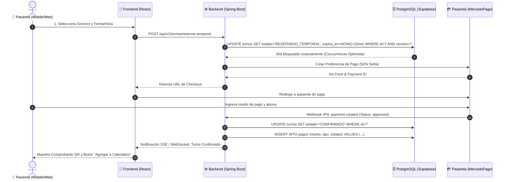

# 📘 Manual Maestro de Ingeniería de Software, Metodología de Especificación y Desarrollo Ágil con Agentes de IA

**Documento Marco de Referencia Técnica y Operativa para Proyectos de Software de Alta Complejidad**  
**Autoría / Referencia:** Framework de Ingeniería de Software Integrador  
**Versión:** 1.0.0 · **Vigencia:** 2026 en adelante  
**Ámbito:** Arquitectura Full-Stack, Modelado Formal, Documentación Modular, Calidad CI/CD, DevOps y Orquestación de Agentes de IA (Agentic AI Workflow)

---

## 🎯 1. Propósito y Filosofía del Estándar

El presente documento constituye la **Guía Maestra y Blueprint de Ingeniería** para concebir, especificar, diseñar, implementar, auditar y desplegar sistemas de software con el **máximo estándar de profesionalismo, rigor técnico y formalidad académica/empresarial**.

Este marco unifica:
1. **Rigor en la Ingeniería de Requisitos:** Adopción de la metodología formal *How I Spec* (Rivera), modelado de procesos en **BPMN 2.0**, análisis formal de **Casos de Uso**, y diseño de bases de datos normalizadas en **3FN / BCNF** con garantías transaccionales **ACID**.
2. **Excelencia Arquitectónica:** Separación estricta de responsabilidades mediante **Clean Layered Architecture (Monolito Modular)** en Backend, patrones **Mobile-First & Responsive UX (WCAG 2.1 AA)** en Frontend, y desacoplamiento de servicios cloud auxiliares.
3. **Ingeniería de Contexto para Agentes de IA (Agentic AI Workflow):** Protocolos reproducibles para solicitar tareas a modelos de lenguaje y agentes autónomos (como Antigravity, Claude, GPT), eliminando ambigüedades, maximizando la precisión de código y garantizando ciclos de feedback automatizados.
4. **DevOps & Calidad Continua:** Contenedores **Docker Multi-Stage**, orquestación local reproducible con **Docker Compose**, pipelines de **Integración Continua (CI/CD)** en GitHub Actions, y despliegue desacoplado en infraestructuras cloud modernas (PostgreSQL/Supabase, Railway/Render, Vercel).

---

## 🧭 2. Los 7 Pilares de Excelencia Técnica

```
                                  ╔═════════════════════════════════════════════╗
                                  ║         7 PILARES DE EXCELENCIA TÉCNICA     ║
                                  ╚═════════════════════════════════════════════╝
                                                         │
         ┌───────────────────┬───────────────────┼───────────────────┬───────────────────┐
         ▼                   ▼                   ▼                   ▼                   ▼
 ┌───────────────┐   ┌───────────────┐   ┌───────────────┐   ┌───────────────┐   ┌───────────────┐
 │ 1. ESPECIF.   │   │ 2. CLEAN      │   │ 3. MOBILE-    │   │ 4. DATOS &    │   │ 5. AGENTIC    │
 │ FORMAL & PRD  │   │ ARCHITECTURE  │   │ FIRST & A11Y  │   │ ACID / AUDIT  │   │ AI PROMPTING  │
 └───────────────┘   └───────────────┘   └───────────────┘   └───────────────┘   └───────────────┘
         │                                                                               │
         └───────────────────────────────┬───────────────────────────────────────────────┘
                                         ▼
                         ┌───────────────────────────────┐
                         │ 6. CI/CD & AUTOMATED TESTING  │
                         │ 7. DEPLOYMENT & CLOUD DEVOPS  │
                         └───────────────────────────────┘
```

| Pilar | Principio Fundamental | Criterio de Aceptación |
| :--- | :--- | :--- |
| **1. Requisitos Formales** | Todo desarrollo parte de un PRD versionado (*How I Spec*), BPMN 2.0 y Casos de Uso. | Cero desarrollo sin especificación previa aprobada y trazable. |
| **2. Clean Architecture** | Dependencias unidireccionales hacia el dominio. El núcleo de negocio es agnóstico a frameworks. | Entidades y reglas de negocio puras, desacopladas de JPA, Web y Cloud. |
| **3. Mobile-First & A11Y** | Diseño pensado en la ergonomía de la mano (*Thumb Zone*) y accesibilidad WCAG 2.1 AA. | *BottomNav*, *Bottom Sheets*, botones $\ge 48\times48\text{ px}$, contraste de color validado. |
| **4. Integridad & ACID** | Consistencia transaccional, control de concurrencia optimista (`@Version`) y auditoría inmutable. | Prevención de *Lost Updates*, prevención de *Race Conditions*, logs de auditoría en BD. |
| **5. Metodología Agentic AI** | Prompts estructurados con contexto, restricciones, interfaces, edge cases y verificación. | Tareas atómicas ejecutables por agentes de IA con compilación y tests en verde. |
| **6. Calidad Continua (CI)** | Automatización de compilación, análisis estático de tipos y suites de tests en cada push. | CI obligatorio en GitHub Actions: `mvn test` y `tsc --noEmit` sin warnings críticos. |
| **7. DevOps & Despliegue** | Contenedores Docker multi-stage con usuarios sin privilegios y despliegue desacoplado. | Imágenes de producción mínimas (<200MB), puertos no privilegiados y variables en `.env`. |

---

## 📜 3. Metodología de Especificación y Documentación Técnica

### 3.1. Estructura de Carpetas de Documentación Modular

Para evitar documentos monolíticos inmanejables, la documentación debe organizarse en **carpetas modulares numeradas por fases** y un historial central de PRDs:

```text
documentacion/
├── 00_INDICE_GENERAL.md                                  # Mapa maestro, guía de lectura y referencias
├── historial_prds/                                       # Bitácora cronológica inmutable de versiones del PRD
│   ├── CHANGELOG_PRDS.md                                 # Tabla de cambios, autores, fecha y alcance
│   ├── PRD_v1.0_Fase1_Inicial.md                         # Requerimientos base y universo de discurso
│   ├── PRD_v2.0_Fase2_Backend_Storage_Tests.md           # Backend, persistencia y tests
│   └── PRD_vN.0_FaseN_Master_Final.md                    # PRD vigente consolidado
├── fase1_especificacion_y_diseno/                        # Diagramas UML, MER, MR y Glosario Técnico
├── fase2_backend_y_calidad/                              # Lógica de negocio, algoritmos y tests unitarios
├── fase3_frontend_avanzado_y_devops/                     # UI/UX médica, estados y Docker
├── fase4_bpmn_y_casos_de_uso/                            # Modelado BPMN 2.0 y Casos de Uso formales
├── fase5_cicd_y_calidad_continua/                        # Workflows de GitHub Actions y calidad
├── fase6_comprobantes_y_pdf/                             # Generación de reportes/PDFs y compliance
├── fase7_dashboard_metricas_y_kpis/                      # Métricas analíticas y fórmulas de negocio
├── fase8_recordatorios_y_calendarios/                    # Integraciones y sincronización iCal/Google
├── fase9_guia_de_defensa_y_pitch/                        # Pitch, guión de demo y preguntas críticas
└── fase10_diseno_mobile_y_responsive/                    # Ergonomía táctil, Bottom Sheets y UI adaptativa
```

---

### 3.2. Taxonomía Estricta de Requerimientos (*How I Spec* / Rivera)

Todo PRD debe estructurar sus requisitos bajo la siguiente convención de nomenclatura:

#### A. Requerimientos Funcionales (`RF-XX`)
Deben formularse con identificador único, nombre descriptivo, actor principal, precondiciones, flujo y postcondiciones.

```markdown
### `RF-01`: Reserva de Turno Online con Pago de Seña Obligatoria
- **Actor Principal:** Paciente no autenticado o registrado.
- **Descripción:** El sistema debe permitir seleccionar un servicio dermatológico, un profesional médico, una fecha/hora disponible y abonar el 50% del valor en concepto de seña mediante pasarela de pago.
- **Precondición:** El slot horario debe encontrarse en estado `LIBRE`.
- **Postcondición:** El slot se bloquea temporalmente por 10 minutos (TTL). Al confirmarse el webhook de pago, cambia a estado `CONFIRMADO` y se emite el comprobante digital con código QR.
```

#### B. Requerimientos No Funcionales (`RNF-XX`)
Definen atributos de calidad, restricciones técnicas y niveles de servicio medibles.

| ID | Categoría | Métrica / Estándar Objetivo | Justificación Técnica |
| :--- | :--- | :--- | :--- |
| `RNF-01` | **Rendimiento** | Tiempo de respuesta del endpoint de slots < 200 ms (P95). | Experiencia fluida sin fricción en el embudo de reservas. |
| `RNF-02` | **Seguridad** | Cifrado en tránsito (TLS 1.3 / HTTPS) y en reposo (AES-256). Autenticación stateless con JWT (HS256/RS256). | Cumplimiento de secreto profesional y normativas de datos de salud. |
| `RNF-03` | **Disponibilidad** | 99.9% uptime anual mediante infraestructura desacoplada y redundante. | Operación crítica de agendamiento y atención médica continua. |
| `RNF-04` | **Accesibilidad** | Cumplimiento WCAG 2.1 Nivel AA (Touch targets $\ge 48\times48\text{ px}$, ratio de contraste $\ge 4.5:1$). | Inclusión universal en dispositivos móviles para pacientes de toda edad. |
| `RNF-05` | **Portabilidad** | Despliegue 100% contenerizado en Docker compatible con Linux x86_64 y ARM64. | Reproducibilidad idéntica en entornos de desarrollo, staging y producción. |

#### C. Reglas de Negocio Inmutables (`RN-XX`)
Leyes de dominio que rigen la lógica de la aplicación:

```markdown
- `RN-01 (Seña Obligatoria):` Ningún turno dermatológico o estético queda en estado `CONFIRMADO` sin haber registrado y liquidado el pago exacto del 50% del precio de lista del servicio.
- `RN-02 (Bloqueo Temporal TTL):` Al seleccionar un slot, el sistema aplica un bloqueo con caducidad estricta de 10 minutos. Si el pago no se completa en dicho lapso, un scheduler o trigger libera automáticamente el slot.
- `RN-03 (Auditoría Médica Inmutable):` Ninguna evolución médica o imagen clínica en la Historia Clínica puede ser editada o eliminada físicamente de la base de datos (Ley 26.529). Todo cambio genera un registro histórico `MedicalRecordAudit` con autor, timestamp y diff JSON.
- `RN-04 (Bloqueo por Fuerza Bruta):` Tras 5 intentos fallidos consecutivos de inicio de sesión en un lapso de 15 minutos, la cuenta se bloquea automáticamente por 30 minutos.
```

---

### 3.3. Modelado de Procesos BPMN 2.0 y Diagramas de Arquitectura

Todo flujo de negocio crítico debe diagramarse formalmente en **Mermaid** o BPMN 2.0. Ejemplo de flujo de agendamiento y pago con compensación por timeout:



---

## 🏛️ 4. Arquitectura de Software y Criterio Técnico

### 4.1. Clean Layered Architecture (Monolito Modular)

La estructura del Backend debe organizarse en **4 capas concéntricas con estricta inversión de dependencias**:

```
 ┌─────────────────────────────────────────────────────────────────────────┐
 │ PRESENTATION LAYER (Controladores REST, DTOs, Exception Advice)         │
 └────────────────────────────────────┬────────────────────────────────────┘
                                      │ Invoca Use Cases / DTOs
                                      ▼
 ┌─────────────────────────────────────────────────────────────────────────┐
 │ APPLICATION LAYER (Servicios de Aplicación, Orquestación, Schedulers)   │
 └────────────────────────────────────┬────────────────────────────────────┘
                                      │ Orquesta Entidades & Reglas
                                      ▼
 ┌─────────────────────────────────────────────────────────────────────────┐
 │ DOMAIN LAYER (Entidades Puras, Value Objects, Excepciones, Puertos Repos)│
 └────────────────────────────────────▲────────────────────────────────────┘
                                      │ Implementa Interfaces (DIP)
 ┌────────────────────────────────────┴────────────────────────────────────┐
 │ INFRASTRUCTURE LAYER (JPA Adapters, Supabase Storage, MercadoPago, AI)   │
 └─────────────────────────────────────────────────────────────────────────┘
```

#### Estructura de Paquetes en Backend (Java / Spring Boot)
```text
backend/src/main/java/com/empresa/proyecto/
├── domain/                               # NÚCLEO PURO (Cero dependencias de Spring/JPA)
│   ├── model/                            # Entidades de Dominio (Appointment, Patient, MedicalRecord)
│   ├── exception/                        # Excepciones de Reglas de Negocio (BusinessRuleException)
│   └── repository/                       # Interfaces de Repositorio (Puertos de salida)
│
├── application/                          # CASOS DE USO Y ORQUESTACIÓN
│   ├── service/                          # Implementación de Casos de Uso con @Transactional
│   └── dto/                              # DTOs de Aplicación y Mappers
│
├── infrastructure/                       # ADAPTADORES TECNOLÓGICOS (Detalles de implementación)
│   ├── persistence/                      # Adaptadores JPA, Entidades de BD y Spring Data Repos
│   ├── security/                         # Spring Security 6, JWT Filters, BCrypt, RBAC
│   ├── payment/                          # Adaptador SDK MercadoPago / Stripe
│   ├── ai/                               # Adaptador Google Gemini API / OpenAI
│   └── storage/                          # Adaptador Supabase Storage / AWS S3
│
└── presentation/                         # CAPA DE ENTRADA (Controladores Web REST)
    ├── controller/                       # @RestController con endpoints versionados (/api/v1/...)
    ├── dto/request/                      # DTOs de entrada validados con @NotNull, @Email, @Size
    ├── dto/response/                     # DTOs de salida inmutables (Records)
    └── advice/                           # @RestControllerAdvice (Mapeo de excepciones a RFC 7807)
```

---

### 4.2. Control de Concurrencia y Transacciones ACID

Para evitar inconsistencias en reservas de recursos compartidos (como turnos, asientos o inventarios):

1. **Concurrencia Optimista con `@Version`**:
   ```java
   @Entity
   @Table(name = "turnos")
   public class Appointment {
       @Id
       @GeneratedValue(strategy = GenerationType.IDENTITY)
       private Long id;

       @Version
       private Long version; // Incrementado automáticamente por Hibernate para detectar colisiones
       
       @Enumerated(EnumType.STRING)
       private AppointmentStatus status;
       // ...
   }
   ```
2. **Manejo de Excepciones de Colisión**:
   Si dos usuarios intentan reservar el mismo slot simultáneamente, Hibernate lanza una `OptimisticLockException`. El servicio debe capturarla y traducirla a una respuesta limpia `409 Conflict` ("El turno acaba de ser seleccionado por otro usuario").
3. **Nivel de Aislamiento Transaccional**:
   ```java
   @Transactional(isolation = Isolation.READ_COMMITTED, rollbackFor = Exception.class)
   public AppointmentResponseDTO bookTemporarySlot(Long slotId, Long patientId) {
       // Operaciones atómicas garantizadas
   }
   ```

---

### 4.3. Frontend: Mobile-First, Ergonomía Táctil y Feature-Sliced

La estructura del Frontend (React + TypeScript + Vite) debe orientarse a **módulos por funcionalidad (*features*)**:

```text
frontend/src/
├── components/                           # Componentes genéricos de UI compartidos
│   ├── BottomNav.tsx                     # Barra de navegación fija inferior para móviles
│   ├── Navbar.tsx                        # Barra superior para pantallas de escritorio
│   ├── DashboardLayout.tsx               # Layout maestro adaptativo (Mobile BottomNav / Desktop Sidebar)
│   └── ErrorBoundary.tsx                 # Atrapador global de errores React
│
├── features/                             # MÓDULOS DE NEGOCIO ENCAPSULADOS
│   ├── appointments/                     # Wizard de reservas en 4 pasos, selección de slots
│   ├── clinical/                         # Historia clínica, visor antes/después, timeline de auditoría
│   ├── agenda/                           # Agenda médica con carrusel de días táctil y grilla semanal
│   ├── analytics/                        # Dashboard analítico con gráficos interactivos y KPIs
│   ├── documents/                        # Modales tipo Bottom Sheet para Comprobantes QR y Consentimientos
│   └── auth/                             # Login con simulador RBAC, recuperación de contraseña
│
├── services/                             # Clientes HTTP (Axios/Fetch) y SDKs (Supabase)
├── types/                                # Definiciones de tipos TypeScript estrictos (interfaces, enums)
└── utils/                                # Helpers de fechas, generador de calendarios (.ics), formatos
```

#### Reglas de Ergonomía Táctil y Mobile-First:
- **Thumb Zone Design:** Las acciones primarias (reservar, confirmar, cambiar fecha) deben ubicarse en la mitad inferior de la pantalla.
- **Touch Targets:** Todo botón o elemento interactivo debe medir como mínimo **48x48 px** con un espaciado intermedio de al menos 8 px.
- **Bottom Sheets en lugar de Modales Centrados:** En dispositivos con ancho $< 768\text{ px}$, las ventanas emergentes deben deslizarse desde abajo (*sheet modal*) con tirador visual táctil.

---

## 🤖 5. Metodología Agentic AI: Desarrollo Ágil con Agentes de Inteligencia Artificial

Para maximizar la productividad y precisión al delegar tareas de desarrollo a agentes de IA (como Antigravity, Claude, GPT), se debe utilizar el siguiente **Protocolo de Ingeniería de Prompts y Descomposición de Tareas**.

```
 ┌────────────────────────────────────────────────────────────────────────┐
 │                    CICLO AGÉNTICO DE DESARROLLO (A-LOOP)               │
 └────────────────────────────────────────────────────────────────────────┘
                                      │
   1. ESPECIFICACIÓN ────────► 2. PLAN TÉCNICO ────────► 3. APROBACIÓN
   (PRD / Contratos)           (implementation_plan.md)    (User Review)
                                                                │
                                                                ▼
   6. WALKTHROUGH ◄────────── 5. VERIFICACIÓN ◄────────── 4. EJECUCIÓN
   (walkthrough.md)            (mvn test / tsc)            (Clean Code)
```

---

### 5.1. Estructura Maestra de un Prompt para Agentes de IA

Todo pedido a un agente de IA debe estructurarse obligatoriamente con los siguientes 6 bloques:

```markdown
### 1. Rol y Perfil Técnico
Actúa como un **Staff Principal Software Engineer & Cloud Architect** especializado en [Java 17 / Spring Boot / React / TypeScript / PostgreSQL].

### 2. Contexto del Proyecto y Ubicación
- **Proyecto:** Sistema Integral de [Nombre del Proyecto].
- **Arquitectura:** Clean Layered Architecture con backend modular y frontend SPA Mobile-First.
- **Archivos Relevantes:** `backend/src/.../AppointmentService.java`, `frontend/src/.../BookingWizard.tsx`.

### 3. Objetivo Claro y No Ambiguo
Implementar la funcionalidad de [Descripción exacta de la tarea], asegurando que [Comportamiento esperado].

### 4. Restricciones Innegociables
- No romper contratos de API existentes ni alterar interfaces públicas sin retrocompatibilidad.
- Seguir estrictamente la separación en capas (Dominio puro sin anotaciones de persistencia).
- En Frontend: TypeScript estricto, cero uso de `any`, diseño adaptativo Mobile-First.
- En Backend: Transaccionalidad `@Transactional`, control de excepciones con `BusinessRuleException`.
- Manejar todos los Edge Cases: recursos no encontrados (404), datos inválidos (400), colisiones de concurrencia (409).

### 5. Entradas y Salidas Esperadas
- **Input DTO:** `CreateAppointmentRequestDTO(Long serviceId, LocalDateTime dateTime, String patientDni)`.
- **Output DTO:** `AppointmentResponseDTO(Long id, String qrCode, BigDecimal depositAmount, AppointmentStatus status)`.

### 6. Protocolo de Verificación
1. Ejecutar la compilación estática de tipos: `npm run build` o `tsc --noEmit`.
2. Ejecutar la suite de tests unitarios: `mvn test -Dtest=AppointmentServiceTest`.
3. Validar que no existan advertencias ni errores en consola.
```

---

### 5.2. Descomposición de Tareas (Task Breakdown Matrix)

Al abordar un proyecto grande, dividir el trabajo en fases atómicas siguiendo la regla de dependencias:

| Paso | Capa / Hito | Responsabilidad del Agente | Criterio de Verificación |
| :---: | :--- | :--- | :--- |
| **1** | **Base de Datos & DDL** | Diseñar tablas en 3FN, claves foráneas, índices B-Tree y scripts de migración. | Script SQL ejecutable en PostgreSQL sin errores de sintaxis. |
| **2** | **Capa de Dominio** | Crear entidades puras, enums y contratos de interfaz de repositorio. | Compilación limpia sin dependencias de frameworks externos. |
| **3** | **Capa de Aplicación** | Implementar Use Cases / Servicios con validación de reglas de negocio y transacciones. | Tests unitarios JUnit 5 con Mockito con cobertura de casos felices y bordes. |
| **4** | **Capa de Infraestructura** | Implementar adaptadores JPA, clientes HTTP para APIs externas (MercadoPago, Gemini, Supabase). | Tests de integración o mocks de conectividad funcionando. |
| **5** | **Capa de Presentación** | Crear Controladores REST, DTOs con Bean Validation y ControllerAdvice. | Endpoints accesibles vía Swagger / Postman con códigos HTTP semánticos (200, 201, 400, 404, 409). |
| **6** | **Frontend Types & Services**| Crear tipos TypeScript sincronizados con los DTOs del backend y cliente API. | `tsc --noEmit` exitoso sin inconsistencias de tipos. |
| **7** | **Frontend UI & Features** | Construir componentes visuales, wizards, modales Bottom Sheet y validaciones con hooks. | Renderizado responsive sin overflow en pantallas móviles (375px a 1440px). |
| **8** | **DevOps & CI/CD** | Configurar Dockerfiles multi-stage, docker-compose.yml y pipelines de GitHub Actions. | `docker compose up --build` levanta todos los servicios de forma limpia. |

---

## ⚡ 6. Optimización, Rendimiento y Seguridad de Grado Empresarial

### 6.1. Optimización en Base de Datos y Persistencia
- **Indexación Selectiva:** Crear índices B-Tree en todas las claves foráneas (`FOREIGN KEY`) y en campos utilizados en cláusulas `WHERE`, `ORDER BY` o `JOIN` (e.g. `fecha_hora`, `estado`, `dni_paciente`).
- **Eliminación del Problema $N+1$:** Utilizar consultas `@EntityGraph(attributePaths = {"paciente", "servicio"})` o `JOIN FETCH` en JPA para cargar relaciones en una única consulta SQL eficiente.
- **Proyecciones DTO Ligeras:** Para listados masivos (e.g. agenda o reportes), utilizar interfaces de proyección o queries JPQL que seleccionen únicamente las columnas requeridas (`SELECT new com...DTO(a.id, a.fecha) FROM Appointment a`).

---

### 6.2. Optimización en Frontend
- **Code-Splitting por Rutas:** Cargar vistas bajo demanda mediante `React.lazy()` y `Suspense`, reduciendo el paquete inicial de JavaScript en más de un 60%:
  ```tsx
  const AnalyticsDashboardView = React.lazy(() => import('./features/analytics/AnalyticsDashboardView'));
  ```
- **Memoización Estratégica:** Emplear `useMemo` para filtrados de colecciones grandes o transformaciones de calendarios, y `useCallback` para manejadores de eventos pasados a componentes hijos pesados.
- **Optimización de Assets:** Uso de formatos WebP/AVIF para imágenes clínicas, lazy loading nativo (`loading="lazy"`) y empaquetado optimizado con Vite.

---

### 6.3. Seguridad y Cumplimiento Normativo (Security by Design)
- **Control de Acceso Basado en Roles (RBAC):**
  * `PACIENTE`: Acceso exclusivo a sus propios turnos, recetas y consentimientos informados.
  * `SECRETARIA / RECEPCION`: Gestión de agenda, confirmación de pagos en mostrador y registro de pacientes.
  * `MEDICA / PROFESIONAL`: Acceso completo a historias clínicas, evoluciones, imágenes y bloqueos de agenda.
  * `ADMINISTRADOR`: Gestión de usuarios, catálogo de servicios, precios y dashboards analíticos globales.
- **Auditoría Inmutable (Compliance de Salud - Ley 26.529 / GDPR):**
  * Toda inserción o modificación en una ficha clínica dispara un registro automático en `clinical_entries_audit` con usuario auditor, IP de origen, timestamp y payload antes/después.
- **Protección de Cabeceras HTTP:**
  * Configuración de `X-Content-Type-Options: nosniff`, `X-Frame-Options: DENY`, `X-XSS-Protection: 1; mode=block` y `Content-Security-Policy`.

---

## 🐳 7. DevOps, Contenerización, CI/CD y Despliegue en la Nube

### 7.1. Dockerfile Multi-Stage de Producción para Backend

Un Dockerfile profesional debe estructurarse en múltiples etapas para reducir la superficie de ataque y el peso final de la imagen:

```dockerfile
# ==========================================
# STAGE 1: Compilación con Maven y JDK 17
# ==========================================
FROM maven:3.9.6-eclipse-temurin-17 AS builder
WORKDIR /build

# Cachear dependencias descargando el repositorio offline
COPY pom.xml .
RUN mvn dependency:go-offline -B

# Compilar código fuente y generar JAR ejecutable
COPY src ./src
RUN mvn clean package -DskipTests -B

# ==========================================
# STAGE 2: Imagen Ligera de Ejecución JRE 17
# ==========================================
FROM eclipse-temurin:17-jre
WORKDIR /app

# Crear usuario sin privilegios root
RUN groupadd -r appgroup && useradd -r -g appgroup appuser

# Copiar el artefacto compilado
COPY --from=builder /build/target/*.jar app.jar
RUN chown -R appuser:appgroup /app
USER appuser

EXPOSE 8080

# Flags optimizados para memoria en contenedores
ENV JAVA_OPTS="-XX:+UseContainerSupport -XX:MaxRAMPercentage=75.0 -XX:+UseG1GC -Djava.security.egd=file:/dev/./urandom"

ENTRYPOINT ["sh", "-c", "java $JAVA_OPTS -jar app.jar"]
```

---

### 7.2. Orquestación Local con Docker Compose

```yaml
version: '3.8'

services:
  postgres:
    image: postgres:15-alpine
    container_name: clinica-postgres
    environment:
      POSTGRES_DB: clinica_dermatologica
      POSTGRES_USER: postgres
      POSTGRES_PASSWORD: ${POSTGRES_PASSWORD:-postgrespassword}
    ports:
      - "5432:5432"
    volumes:
      - postgres_data:/var/lib/postgresql/data
    healthcheck:
      test: ["CMD-SHELL", "pg_isready -U postgres -d clinica_dermatologica"]
      interval: 5s
      timeout: 5s
      retries: 5

  backend:
    build:
      context: ./backend
      dockerfile: Dockerfile
    container_name: clinica-backend
    ports:
      - "8080:8080"
    environment:
      SPRING_DATASOURCE_URL: jdbc:postgresql://postgres:5432/clinica_dermatologica?sslmode=disable
      SPRING_DATASOURCE_USERNAME: postgres
      SPRING_DATASOURCE_PASSWORD: ${POSTGRES_PASSWORD:-postgrespassword}
      JWT_SECRET_KEY: ${JWT_SECRET_KEY}
    depends_on:
      postgres:
        condition: service_healthy

  frontend:
    image: node:20-alpine
    container_name: clinica-frontend
    working_dir: /app
    ports:
      - "5173:5173"
    volumes:
      - ./frontend:/app
    command: sh -c "npm install && npm run dev -- --host 0.0.0.0"
    depends_on:
      - backend

volumes:
  postgres_data:
    driver: local
```

---

### 7.3. Pipeline de Integración Continua (GitHub Actions)

Los workflows deben ubicarse en `.github/workflows/` y ejecutarse en cada `push` o `pull_request`:

```yaml
name: Backend CI (Spring Boot Java 17)

on:
  push:
    branches: [ main ]
    paths:
      - 'backend/**'
      - '.github/workflows/backend-ci.yml'
  pull_request:
    branches: [ main ]

jobs:
  test-and-build:
    runs-on: ubuntu-latest
    steps:
      - name: Checkout del Repositorio
        uses: actions/checkout@v4

      - name: Configurar JDK 17 (Eclipse Temurin)
        uses: actions/setup-java@v4
        with:
          java-version: '17'
          distribution: 'temurin'
          cache: 'maven'

      - name: Ejecutar Tests Unitarios (JUnit 5 + Mockito)
        working-directory: ./backend
        run: mvn clean test -B

      - name: Compilar Paquete JAR
        working-directory: ./backend
        run: mvn package -DskipTests -B

      - name: Publicar Reporte Surefire
        if: always()
        uses: actions/upload-artifact@v4
        with:
          name: surefire-test-reports
          path: backend/target/surefire-reports/
```

---

## 🗂️ 8. Topología y Organización Estándar de Proyectos

A continuación se detalla la estructura canónica recomendada para cualquier proyecto de esta envergadura:

```text
📦 PROYECTO-RAIZ/
│
├── 📄 README.md                          # Presentación visual con badges, arquitectura, módulos y quickstart
├── 📄 Dockerfile                         # Dockerfile raíz multi-stage para despliegues cloud (Railway/Render)
├── 📄 docker-compose.yml                 # Orquestación local (PostgreSQL + Backend + Frontend)
├── 📄 railway.toml                       # Configuración declarativa de build y reinicio en Railway
├── 📄 vercel.json                        # Configuración de SPA routing y cabeceras de seguridad en Vercel
├── 🔒 .env.example                       # Plantilla de variables de entorno sin credenciales reales
├── 🚫 .gitignore                         # Exclusiones de Git (.DS_Store, target/, dist/, node_modules/, .env)
│
├── 📂 .github/
│   └── 📂 workflows/
│       ├── 📄 backend-ci.yml             # Pipeline CI para Java 17 / Maven / JUnit 5
│       └── 📄 frontend-ci.yml            # Pipeline CI para TypeScript / Vite Build
│
├── 📂 documentacion/                     # Módulo centralizado de especificación formal
│   ├── 📄 00_INDICE_GENERAL.md           # Índice maestro navegable
│   ├── 📄 GUIA_MAESTRA_ESTANDAR.md       # Este documento maestro
│   ├── 📂 historial_prds/                # CHANGELOG y PRD v1.0 a vN.0 (How I Spec)
│   ├── 📂 fase1_especificacion_y_diseno/ # Diagramas UML, MER, MR y Glosario
│   ├── 📂 fase2_backend_y_calidad/       # Algoritmos, storage y tests unitarios
│   ├── 📂 fase3_frontend_y_devops/       # UI/UX médica y Docker
│   ├── 📂 fase4_bpmn_y_casos_de_uso/     # Procesos BPMN 2.0 y Casos de Uso
│   ├── 📂 fase5_cicd_y_calidad/          # Automatización de integración continua
│   ├── 📂 fase6_comprobantes_pdf/        # Documentos PDF y firmas legales
│   ├── 📂 fase7_dashboard_kpis/          # Métricas analíticas
│   ├── 📂 fase8_recordatorios_sync/      # Google Calendar y archivos .ics
│   ├── 📂 fase9_guia_defensa_pitch/      # Guión de demo y preguntas trampa
│   └── 📂 fase10_diseno_mobile_first/    # BottomNav, Bottom Sheets y ergonomía táctil
│
├── 📂 backend/                           # API REST Spring Boot (Java 17)
│   ├── 📄 pom.xml                        # Dependencias Maven (Spring Boot 3, JPA, Security, Gemini, MP)
│   ├── 📄 Dockerfile                     # Dockerfile multi-stage local del backend
│   └── 📂 src/
│       ├── 📂 main/java/com/app/
│       │   ├── 📂 domain/                # Modelos puros, Excepciones y Puertos Repositorio
│       │   ├── 📂 application/           # Servicios de Casos de Uso con @Transactional
│       │   ├── 📂 infrastructure/        # Adaptadores JPA, Security JWT, Storage, MercadoPago, Gemini
│       │   └── 📂 presentation/          # Controladores REST, DTOs de Entrada/Salida, ExceptionAdvice
│       └── 📂 test/java/com/app/         # Tests unitarios con JUnit 5, Mockito y AssertJ
│
└── 📂 frontend/                          # SPA React (TypeScript + Vite + Tailwind)
    ├── 📄 package.json                   # Dependencias (React 18, Tailwind, Lucide, Canvas-Confetti, QrCode)
    ├── 📄 tsconfig.json                  # Configuración TypeScript estricta (noImplicitAny, strict)
    ├── 📄 vite.config.ts                 # Configuración de bundler Vite y servidor de desarrollo
    ├── 📄 tailwind.config.js             # Sistema de diseño, paleta médica, espaciados y sombras
    └── 📂 src/
        ├── 📂 components/                # BottomNav, Navbar, Layout, ErrorBoundary
        ├── 📂 features/                  # Módulos de negocio (Appointments, Clinical, Agenda, Analytics)
        ├── 📂 services/                  # Clientes Axios / Fetch y Supabase Client
        ├── 📂 types/                     # Interfaces TypeScript y modelos de datos
        └── 📂 utils/                     # Generador de calendarios (.ics), formateadores de fecha/moneda
```

---

## 📋 9. Plantillas Rápidas Listas para Usar (Boilerplates)

### 9.1. Plantilla de PRD Estándar (Markdown)
```markdown
# PRD v[X.Y] — [Nombre del Módulo o Fase]

**Proyecto:** [Nombre del Sistema]  
**Fecha:** [YYYY-MM-DD] · **Estado:** [Borrador / Aprobado / En Producción]  
**Autor:** [Nombre / Equipo]

---

## 1. Visión y Universo de Discurso
[Descripción del problema de negocio que se busca resolver, contexto operativo y valor generado].

## 2. Requerimientos Funcionales (RF)
- **`RF-01` [Nombre]:** Como [Actor], quiero [Acción] para [Beneficio].
  - *Precondición:* [Estado previo necesario].
  - *Postcondición:* [Estado final garantizado].

## 3. Requerimientos No Funcionales (RNF)
- **`RNF-01` Rendimiento:** Tiempo de respuesta $< 200\text{ ms}$ en el percentil 95.
- **`RNF-02` Seguridad:** Control de acceso mediante roles (RBAC) y tokens JWT.

## 4. Reglas de Negocio (RN)
- **`RN-01`:** [Regla inquebrantable de validación o cálculo].

## 5. Diagrama de Flujo / BPMN
[Diagrama Mermaid con la secuencia de interacción entre actores y componentes].

## 6. Matriz de Casos de Prueba
| ID Caso | Precondición | Entrada / Acción | Resultado Esperado | Código HTTP |
| :--- | :--- | :--- | :--- | :--- |
| `TC-01` | Slot libre | POST /turnos/reservar | Turno en `RESERVADO_TEMPORAL` con TTL 10m | `201 Created` |
| `TC-02` | Slot ocupado | POST /turnos/reservar | Error de colisión capturado | `409 Conflict` |
```

---

### 9.2. Plantilla de Prompt Maestro para Nuevas Fases
```markdown
Quiero implementar la [Fase X: Nombre de la Funcionalidad].

Sigue estrictamente el **Manual Maestro de Ingeniería de Software**:
1. **Arquitectura:** Aplica Clean Architecture (Dominio puro -> Aplicación -> Infraestructura -> Presentación).
2. **Frontend:** Mobile-First con ergonomía en Thumb Zone, TypeScript estricto sin `any` y soporte táctil.
3. **Manejo de Errores:** Excepciones semánticas (`BusinessRuleException`, `ResourceNotFoundException`) gestionadas centralmente por `GlobalExceptionHandler` devolviendo RFC 7807.
4. **Persistencia & Concurrencia:** Concurrencia optimista (`@Version`), transacciones `@Transactional` e índices en claves foráneas.
5. **Calidad:** Crea los tests unitarios en JUnit 5/Mockito para cubrir casos de éxito y de error, y verifica la compilación con `tsc --noEmit` y `mvn test`.
6. **Documentación:** Genera el documento de la fase en `documentacion/faseX_.../` y actualiza el PRD e índice general.
```

---

## 🏁 10. Resumen Ejecutivo y Checklist de Calidad para Nuevos Proyectos

Antes de dar por finalizado o presentar cualquier proyecto ante un cliente, cátedra o tribunal evaluador, verificar:

- [ ] **Documentación:** ¿Existe un `00_INDICE_GENERAL.md` navegable, historial de PRDs versionados y diagramas BPMN/UML?
- [ ] **Arquitectura:** ¿El backend respeta las 4 capas limpias y el dominio permanece libre de dependencias de frameworks?
- [ ] **Mobile-First:** ¿La interfaz móvil cuenta con `BottomNav`, *Bottom Sheets* y zonas de toque $\ge 48\times48\text{ px}$?
- [ ] **Concurrencia:** ¿Los recursos críticos están protegidos con `@Version` o bloqueos con TTL para evitar *Lost Updates*?
- [ ] **Seguridad & RBAC:** ¿Los endpoints están protegidos por roles y las contraseñas hasheadas con BCrypt?
- [ ] **Auditoría:** ¿Las modificaciones críticas quedan registradas en tablas de auditoría inmutables?
- [ ] **CI/CD:** ¿Los workflows de GitHub Actions ejecutan `mvn test` y `tsc --noEmit` de forma automática y exitosa?
- [ ] **DevOps:** ¿El proyecto inicia limpiamente con un único comando `docker compose up`?

---

<div align="center">

**Framework de Ingeniería de Software de Alta Calidad**  
*Diseñado para construir soluciones escalables, mantenibles y profesionales con desarrollo asistido por Agentes de IA.*

</div>
