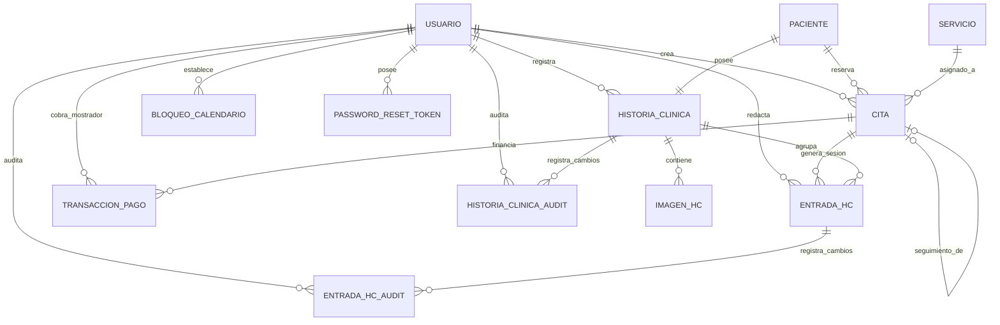

# Documento de Arquitectura, Diseño Técnico y Modelado de Datos

**Proyecto:** Sistema Integral de Gestión Dermatológica y Estética con Inteligencia Artificial  
**Versión:** 1.0.0 · **Fecha:** 2026-08-22  
**Estilo Arquitectónico:** *Clean Layered Architecture* (Monolito Modular en Capas Limpias) + Frontend SPA Desacoplado + Servicios Cloud Especializados (Supabase, MercadoPago, Google Gemini).

---

## 1. Diagrama de Paquetes UML (Arquitectura Limpia en Capas)

La arquitectura de la aplicación sigue los principios de *Clean Architecture* y separación de responsabilidades (*Separation of Concerns*). Las dependencias fluyen estrictamente hacia el interior: **Presentación -> Aplicación -> Dominio**, mientras que la **Infraestructura** implementa los puertos e interfaces definidos por el Dominio y la Aplicación (Principio de Inversión de Dependencias - DIP).

```mermaid
classDiagram
    namespace Presentation_Layer {
        class AuthController
        class AppointmentController
        class PatientController
        class ServiceCatalogController
        class MedicalRecordController
        class PaymentWebhookController
        class GeminiChatbotController
    }

    namespace Application_Layer {
        class AppointmentUseCase
        class MedicalRecordUseCase
        class PaymentProcessingUseCase
        class PatientUseCase
        class ServiceCatalogUseCase
        class GeminiChatbotUseCase
        class AuthenticationUseCase
    }

    namespace Domain_Layer {
        class User
        class Patient
        class DermatologicService
        class Appointment
        class PaymentTransaction
        class MedicalRecord
        class ClinicalEntry
        class ClinicalImage
        class CalendarBlock
        class AppointmentRepository
        class PatientRepository
        class MedicalRecordRepository
        class PaymentTransactionRepository
    }

    namespace Infrastructure_Layer {
        class JpaAppointmentRepositoryAdapter
        class JpaMedicalRecordRepositoryAdapter
        class MercadoPagoSdkPaymentAdapter
        class GoogleGeminiApiClientAdapter
        class SupabaseStorageAdapter
        class JwtTokenProvider
        class SecurityFilterConfig
    }

    Presentation_Layer ..> Application_Layer : Invoca DTOs & Comandos
    Application_Layer ..> Domain_Layer : Orquesta Entidades & Reglas
    Infrastructure_Layer ..|> Domain_Layer : Implementa Repositorios e Interfaces
    Infrastructure_Layer ..|> Application_Layer : Implementa Clientes Externos
```

### Estructura de Paquetes en el Backend (Java 17 / Spring Boot)

```text
backend/src/main/java/com/clinicadermatologica/app/
├── domain/                          # CAPA DE DOMINIO (Núcleo de Negocio Puro - Sin dependencias de frameworks)
│   ├── exception/                   # Excepciones de negocio (BusinessException, SlotUnavailableException, etc.)
│   ├── model/                       # Entidades y Agregados del Dominio (Appointment, MedicalRecord, Patient, etc.)
│   └── repository/                  # Interfaces de Repositorio (AppointmentRepository, PatientRepository, etc.)
│
├── application/                     # CAPA DE APLICACIÓN (Casos de Uso y Orquestación)
│   ├── usecase/                     # Interfaces de Casos de Uso (BookAppointmentUseCase, RegisterClinicalEntryUseCase)
│   └── service/                     # Implementación de Casos de Uso con lógica transaccional de aplicación
│
├── infrastructure/                  # CAPA DE INFRAESTRUCTURA (Adaptadores a Tecnologías y Servicios Externos)
│   ├── ai/                          # Adaptador de integración con Google Gemini API
│   ├── payment/                     # Adaptador de pasarela con MercadoPago SDK
│   ├── persistence/                 # Implementaciones JPA/Hibernate y Mappers de Base de Datos
│   │   ├── adapter/                 # Adaptadores que implementan las interfaces del Domain Repository
│   │   └── jpa/                     # Spring Data JpaRepositories
│   ├── security/                    # Configuración de Spring Security 6, Filtro JWT y UserDetailsService
│   └── storage/                     # Adaptador para Supabase Storage (Bucket S3 / URLs prefirmadas)
│
└── presentation/                    # CAPA DE PRESENTACIÓN (Controladores REST y Contratos de Entrada/Salida)
    ├── controller/                  # Endpoints REST expuestos a clientes (@RestController)
    ├── dto/                         # Data Transfer Objects (Requests, Responses, ViewModels)
    └── advice/                      # Manejo global de excepciones (@RestControllerAdvice)
```

---

## 2. Diagrama de Despliegue UML (Topología de Infraestructura)

El despliegue está desacoplado para maximizar el rendimiento, la disponibilidad global y la seguridad del sistema médico.

```mermaid
graph TB
    subgraph "Cliente (Dispositivos)"
        BrowserDesktop["Navegador Web Escritorio (Médica / Secretaria)"]
        BrowserMobile["Navegador Móvil / Tablet (Pacientes / Médica)"]
    end

    subgraph "Vercel Edge Platform"
        VercelCDN["Vercel Global Edge Network (CDN)"]
        ReactSPA["React 18 SPA + Vite + Tailwind"]
        VercelCDN --> ReactSPA
    end

    subgraph "Cloud PaaS (Render / Railway / Cloud Run)"
        DockerContainer["Contenedor Docker (Linux x86_64 / Alpine)"]
        SpringBootApp["Java 17 (JVM OpenJDK) + Spring Boot 3.2.x API REST"]
        HikariCP["HikariCP Connection Pool (Max: 10, Min-Idle: 5)"]
        DockerContainer --> SpringBootApp
        SpringBootApp --> HikariCP
    end

    subgraph "Supabase Cloud Platform (AWS us-east-1)"
        PostgresDB[("PostgreSQL 15+ Database Engine")]
        FlywayEngine["Flyway Schema Migrations Engine"]
        StorageBucket["Supabase Storage (S3-Compatible Bucket: 'photos')"]
    end

    subgraph "Servicios Externos de Terceros"
        MercadoPagoAPI["MercadoPago API (Checkout Pro & Webhooks)"]
        GeminiAPI["Google Gemini API (gemini-1.5-flash)"]
    end

    BrowserDesktop -->|HTTPS / TLS 1.3 (Puerto 443)| VercelCDN
    BrowserMobile -->|HTTPS / TLS 1.3 (Puerto 443)| VercelCDN
    ReactSPA -->|REST API JSON / Bearer JWT| SpringBootApp
    HikariCP -->|PostgreSQL JDBC SSL (Puerto 5432 / 6543)| PostgresDB
    SpringBootApp -->|HTTP REST Multipart / S3 API| StorageBucket
    SpringBootApp -->|HTTPS SDK / REST (API Key)| MercadoPagoAPI
    SpringBootApp -->|HTTPS REST (API Key)| GeminiAPI
    MercadoPagoAPI -->|HTTP POST Webhook Notification| SpringBootApp
```

---

## 3. Modelo Entidad-Relación (MER) y Modelo Relacional (MR)

### Diagrama Entidad-Relación (MER Extendido)



### Especificación del Modelo Relacional (MR) en Supabase PostgreSQL

#### 1. Tabla `usuario`
- `id` BIGSERIAL PRIMARY KEY
- `username` VARCHAR(50) NOT NULL UNIQUE
- `password_hash` VARCHAR(255) NOT NULL
- `email` VARCHAR(100) NOT NULL UNIQUE
- `full_name` VARCHAR(100) NOT NULL
- `role` VARCHAR(20) NOT NULL CHECK (role IN ('ADMIN', 'PHYSICIAN', 'RECEPTIONIST'))
- `active` BOOLEAN NOT NULL DEFAULT TRUE
- `failed_login_attempts` INT NOT NULL DEFAULT 0
- `locked_until` TIMESTAMP WITH TIME ZONE NULL
- `created_at` TIMESTAMP WITH TIME ZONE NOT NULL DEFAULT NOW()
- `updated_at` TIMESTAMP WITH TIME ZONE NOT NULL DEFAULT NOW()

#### 2. Tabla `password_reset_token`
- `id` BIGSERIAL PRIMARY KEY
- `user_id` BIGINT NOT NULL REFERENCES usuario(id) ON DELETE CASCADE
- `token` VARCHAR(255) NOT NULL UNIQUE
- `used` BOOLEAN NOT NULL DEFAULT FALSE
- `expires_at` TIMESTAMP WITH TIME ZONE NOT NULL
- `created_at` TIMESTAMP WITH TIME ZONE NOT NULL DEFAULT NOW()

#### 3. Tabla `paciente`
- `id` BIGSERIAL PRIMARY KEY
- `name` VARCHAR(100) NOT NULL
- `dni` VARCHAR(8) NOT NULL UNIQUE CHECK (dni ~ '^[0-9]{7,8}$')
- `phone` VARCHAR(20) NOT NULL UNIQUE
- `email` VARCHAR(100) NOT NULL UNIQUE
- `birth_date` DATE NULL
- `profession` VARCHAR(100) NULL
- `active` BOOLEAN NOT NULL DEFAULT TRUE
- `created_at` TIMESTAMP WITH TIME ZONE NOT NULL DEFAULT NOW()
- `updated_at` TIMESTAMP WITH TIME ZONE NOT NULL DEFAULT NOW()
- *Índices:* `idx_paciente_dni` en (dni), `idx_paciente_email` en (email), `idx_paciente_name` en (name).

#### 4. Tabla `servicio`
- `id` BIGSERIAL PRIMARY KEY
- `name` VARCHAR(100) NOT NULL UNIQUE
- `description` VARCHAR(500) NULL
- `duration_minutes` INT NOT NULL CHECK (duration_minutes >= 15 AND duration_minutes <= 240)
- `base_price` NUMERIC(12, 2) NOT NULL CHECK (base_price > 0)
- `deposit_percentage` NUMERIC(5, 2) NOT NULL DEFAULT 50.00 CHECK (deposit_percentage >= 0 AND deposit_percentage <= 100)
- `follow_up_interval_days` INT NULL
- `active` BOOLEAN NOT NULL DEFAULT TRUE
- `created_at` TIMESTAMP WITH TIME ZONE NOT NULL DEFAULT NOW()
- `updated_at` TIMESTAMP WITH TIME ZONE NOT NULL DEFAULT NOW()

#### 5. Tabla `cita`
- `id` BIGSERIAL PRIMARY KEY
- `paciente_id` BIGINT NOT NULL REFERENCES paciente(id) ON DELETE RESTRICT
- `servicio_id` BIGINT NOT NULL REFERENCES servicio(id) ON DELETE RESTRICT
- `created_by_user_id` BIGINT NOT NULL REFERENCES usuario(id) ON DELETE RESTRICT
- `start_time` TIMESTAMP WITH TIME ZONE NOT NULL
- `end_time` TIMESTAMP WITH TIME ZONE NOT NULL CHECK (end_time > start_time)
- `status` VARCHAR(30) NOT NULL CHECK (status IN ('PENDING_PAYMENT', 'CONFIRMED', 'CANCELLED', 'COMPLETED', 'PAYMENT_FAILED', 'NO_SHOW'))
- `agreed_price` NUMERIC(12, 2) NOT NULL CHECK (agreed_price >= 0)
- `follow_up_to_id` BIGINT NULL REFERENCES cita(id) ON DELETE SET NULL
- `temporary_hold_deadline` TIMESTAMP WITH TIME ZONE NULL
- `reschedule_count` INT NOT NULL DEFAULT 0
- `original_start_time` TIMESTAMP WITH TIME ZONE NOT NULL
- `version` BIGINT NOT NULL DEFAULT 0
- `created_at` TIMESTAMP WITH TIME ZONE NOT NULL DEFAULT NOW()
- `updated_at` TIMESTAMP WITH TIME ZONE NOT NULL DEFAULT NOW()
- *Índices:* `idx_cita_range` en (start_time, end_time), `idx_cita_status` en (status), `idx_cita_paciente` en (paciente_id).

#### 6. Tabla `transaccion_pago`
- `id` BIGSERIAL PRIMARY KEY
- `cita_id` BIGINT NOT NULL REFERENCES cita(id) ON DELETE RESTRICT
- `mp_preference_id` VARCHAR(100) NULL
- `mp_payment_id` VARCHAR(100) NULL UNIQUE
- `payment_type` VARCHAR(20) NOT NULL CHECK (payment_type IN ('DEPOSIT_50', 'FINAL_BALANCE_50', 'FULL_PAYMENT'))
- `amount` NUMERIC(12, 2) NOT NULL CHECK (amount > 0)
- `status` VARCHAR(20) NOT NULL CHECK (status IN ('PENDING', 'APPROVED', 'REJECTED', 'REFUNDED'))
- `registered_by_user_id` BIGINT NULL REFERENCES usuario(id) ON DELETE RESTRICT
- `payment_date` TIMESTAMP WITH TIME ZONE NOT NULL DEFAULT NOW()
- `created_at` TIMESTAMP WITH TIME ZONE NOT NULL DEFAULT NOW()

#### 7. Tabla `bloqueo_calendario`
- `id` BIGSERIAL PRIMARY KEY
- `created_by_user_id` BIGINT NOT NULL REFERENCES usuario(id) ON DELETE RESTRICT
- `start_time` TIMESTAMP WITH TIME ZONE NOT NULL
- `end_time` TIMESTAMP WITH TIME ZONE NOT NULL CHECK (end_time > start_time)
- `reason` VARCHAR(255) NOT NULL
- `created_at` TIMESTAMP WITH TIME ZONE NOT NULL DEFAULT NOW()

#### 8. Tabla `historia_clinica`
- `id` BIGSERIAL PRIMARY KEY
- `paciente_id` BIGINT NOT NULL UNIQUE REFERENCES paciente(id) ON DELETE RESTRICT
- `created_by_user_id` BIGINT NOT NULL REFERENCES usuario(id) ON DELETE RESTRICT
- `has_hta` BOOLEAN NOT NULL DEFAULT FALSE
- `has_dbt` BOOLEAN NOT NULL DEFAULT FALSE
- `has_hypothyroidism` BOOLEAN NOT NULL DEFAULT FALSE
- `has_hyperthyroidism` BOOLEAN NOT NULL DEFAULT FALSE
- `has_anemia` BOOLEAN NOT NULL DEFAULT FALSE
- `has_autoimmune_diseases` BOOLEAN NOT NULL DEFAULT FALSE
- `has_glaucoma` BOOLEAN NOT NULL DEFAULT FALSE
- `has_coagulation_disorders` BOOLEAN NOT NULL DEFAULT FALSE
- `has_scarring_alterations` BOOLEAN NOT NULL DEFAULT FALSE
- `other_pathological` TEXT NULL
- `allergy_anesthesia` BOOLEAN NOT NULL DEFAULT FALSE
- `allergy_egg` BOOLEAN NOT NULL DEFAULT FALSE
- `allergy_fish` BOOLEAN NOT NULL DEFAULT FALSE
- `other_allergies` TEXT NULL
- `habit_tobacco` BOOLEAN NOT NULL DEFAULT FALSE
- `habit_alcohol` BOOLEAN NOT NULL DEFAULT FALSE
- `habit_sun_exposure` BOOLEAN NOT NULL DEFAULT FALSE
- `habit_spf_use` BOOLEAN NOT NULL DEFAULT FALSE
- `surgical_history` TEXT NULL
- `gynecological_history` TEXT NULL
- `current_medications` TEXT NULL
- `previous_aesthetic_treatments` TEXT NULL
- `fitzpatrick_phototype` VARCHAR(10) NOT NULL CHECK (fitzpatrick_phototype IN ('I', 'II', 'III', 'IV', 'V', 'VI'))
- `physical_examination` TEXT NULL
- `treatment_plan` TEXT NULL
- `informed_consent_signed` BOOLEAN NOT NULL DEFAULT FALSE
- `created_at` TIMESTAMP WITH TIME ZONE NOT NULL DEFAULT NOW()
- `updated_at` TIMESTAMP WITH TIME ZONE NOT NULL DEFAULT NOW()

#### 9. Tabla `historia_clinica_audit`
- `id` BIGSERIAL PRIMARY KEY
- `historia_clinica_id` BIGINT NOT NULL REFERENCES historia_clinica(id) ON DELETE CASCADE
- `modified_by_user_id` BIGINT NOT NULL REFERENCES usuario(id) ON DELETE RESTRICT
- `modified_section` VARCHAR(100) NOT NULL
- `previous_values` JSONB NOT NULL
- `new_values` JSONB NOT NULL
- `modified_at` TIMESTAMP WITH TIME ZONE NOT NULL DEFAULT NOW()

#### 10. Tabla `entrada_hc`
- `id` BIGSERIAL PRIMARY KEY
- `historia_clinica_id` BIGINT NOT NULL REFERENCES historia_clinica(id) ON DELETE RESTRICT
- `cita_id` BIGINT NOT NULL REFERENCES cita(id) ON DELETE RESTRICT
- `author_user_id` BIGINT NOT NULL REFERENCES usuario(id) ON DELETE RESTRICT
- `content` TEXT NOT NULL
- `created_at` TIMESTAMP WITH TIME ZONE NOT NULL DEFAULT NOW()
- `updated_at` TIMESTAMP WITH TIME ZONE NOT NULL DEFAULT NOW()

#### 11. Tabla `entrada_hc_audit`
- `id` BIGSERIAL PRIMARY KEY
- `entrada_hc_id` BIGINT NOT NULL REFERENCES entrada_hc(id) ON DELETE CASCADE
- `modified_by_user_id` BIGINT NOT NULL REFERENCES usuario(id) ON DELETE RESTRICT
- `previous_content` TEXT NOT NULL
- `new_content` TEXT NOT NULL
- `modified_at` TIMESTAMP WITH TIME ZONE NOT NULL DEFAULT NOW()

#### 12. Tabla `imagen_hc`
- `id` BIGSERIAL PRIMARY KEY
- `historia_clinica_id` BIGINT NOT NULL REFERENCES historia_clinica(id) ON DELETE CASCADE
- `file_path` VARCHAR(255) NOT NULL UNIQUE
- `original_filename` VARCHAR(255) NOT NULL
- `content_type` VARCHAR(50) NOT NULL
- `file_size` BIGINT NOT NULL
- `description` VARCHAR(255) NULL
- `uploaded_at` TIMESTAMP WITH TIME ZONE NOT NULL DEFAULT NOW()

---

## 4. Heurísticas de Diseño y Normalización Relacional

1. **Primera Forma Normal (1FN):**
   - Todos los atributos son atómicos (sin listas separadas por comas ni arreglos no estructurados).
   - Las patologías recurrentes y alergias frecuentes se descompusieron en banderas booleanas indexables (`has_hta`, `allergy_anesthesia`, etc.), complementadas con campos de texto abierto (`other_pathological`, `other_allergies`) para casos no tabulados.
2. **Segunda Forma Normal (2FN):**
   - Todas las tablas poseen una clave primaria simple artificial (`id` BIGSERIAL).
   - No existen dependencias funcionales parciales: todos los atributos no clave dependen funcionalmente en su totalidad de la clave primaria única.
3. **Tercera Forma Normal (3FN) y Boyce-Codd (BCNF):**
   - Se eliminaron todas las dependencias transitivas: los datos de contacto y filiación del paciente pertenecen exclusivamente a `paciente` y se referencian por clave foránea `paciente_id` en `cita` e `historia_clinica`.
   - El precio del servicio no se recalcula dinámicamente sobre citas pasadas; se congela en `agreed_price` dentro de `cita` para preservar la validez histórica de la transacción contable.
4. **Integridad Referencial y Acciones en Cascada:**
   - Registros de pacientes, citas y transacciones utilizan `ON DELETE RESTRICT` para evitar la eliminación accidental de registros contables o médicos vinculados.
   - Registros de auditoría e imágenes asociadas utilizan `ON DELETE CASCADE` cuando la entidad padre es depurada administrativamente en entornos de prueba.

---

## 5. Planificación de Transacciones ACID y Niveles de Aislamiento

### Transacción A: Reserva con Bloqueo Temporal (10 min TTL)
- **Nivel de Aislamiento:** `READ COMMITTED` con Control de Concurrencia Optimista (`@Version`).
- **Atomicidad:** Si la llamada a MercadoPago para generar la preferencia falla, se produce rollback de la inserción de la cita y la transacción de pago.
- **Consistencia:** Verificación estricta de solapamiento de horarios con citas confirmadas o reservas en plazo de bloqueo activo.

### Transacción B: Confirmación Asíncrona vía Webhook de MercadoPago
- **Nivel de Aislamiento:** `READ COMMITTED`.
- **Idempotencia:** La notificación de webhook procesa una única vez un `mp_payment_id`. Si ya fue registrado, retorna `HTTP 200` sin duplicar transacciones ni mutar estados consolidados.

### Transacción C: Modificación de Nota de Evolución Médica con Auditoría
- **Nivel de Aislamiento:** `READ COMMITTED` con Atomicidad Estricta (`@Transactional(rollbackFor = Exception.class)`).
- **Garantía:** La actualización del campo `content` en `entrada_hc` y la inserción del registro histórico en `entrada_hc_audit` ocurren en la misma transacción física. Si falla la inserción en auditoría, la nota NO se modifica.

---

## 6. Catálogo de Librerías y Dependencias Justificadas

### Backend (Java 17 + Spring Boot 3.2+)

| Dependencia Maven / Librería | Versión | Propósito Técnico | Justificación / Pros |
| :--- | :--- | :--- | :--- |
| `spring-boot-starter-web` | 3.2.3 | API REST, Servidor Tomcat Embebido | Rápido, maduro, soporte nativo de Jackson JSON y validación. |
| `spring-boot-starter-security` | 3.2.3 | Seguridad, Filtros de Autenticación y RBAC | Estándar de seguridad de nivel bancario, filtros personalizables y protección contra CSRF/CORS. |
| `spring-boot-starter-data-jpa` | 3.2.3 | Mapeo Objeto-Relacional (Hibernate) | Simplifica queries, control de transacciones y optimismo con `@Version`. |
| `spring-boot-starter-validation` | 3.2.3 | Validación de Beans (Hibernate Validator) | Asegura que ningún dato corrupto ingrese a los casos de uso (`@NotNull`, `@Size`, `@Pattern`). |
| `org.postgresql:postgresql` | 42.7.2 | Driver JDBC oficial para PostgreSQL | Conexión optimizada para Supabase con soporte SSL y tipos JSONB. |
| `org.flywaydb:flyway-core` | 10.8.1 | Migración y versionado de Base de Datos | Control de versiones reproducible de scripts DDL/DML. |
| `io.jsonwebtoken:jjwt-api / impl` | 0.12.5 | Generación y validación de Tokens JWT | Tokens firmados HMAC-SHA256 compactos y seguros para sesiones stateless. |
| `org.projectlombok:lombok` | 1.18.30 | Reducción de código repetitivo (*Boilerplate*) | Genera automáticamente getters, setters, builders y constructores limpios. |
| `com.mercadopago:sdk-java` | 2.1.25 | SDK Oficial de MercadoPago | Integración directa con Checkout Pro, Preferencias y Webhooks. |
| `org.springframework.boot:spring-boot-starter-webclient` | 3.2.3 | Cliente HTTP Asíncrono no bloqueante | Comunicación de alto rendimiento y baja latencia con la API de Google Gemini. |
| `org.springframework.boot:spring-boot-starter-test` | 3.2.3 | Suite de Testing (JUnit 5, Mockito, AssertJ) | Pruebas unitarias de casos de uso y pruebas de integración de repositorios y controladores. |

### Frontend (React 18 + TypeScript + Vite)

| Dependencia NPM | Versión | Propósito Técnico | Justificación / Pros |
| :--- | :--- | :--- | :--- |
| `react` & `react-dom` | 18.2.0 | Biblioteca base de interfaz de usuario | Componentes declarativos, hooks modernos y ecosistema maduro. |
| `typescript` | 5.3.3 | Tipado estático estricto | Previene errores en tiempo de compilación y sincroniza contratos de DTOs con el backend. |
| `vite` | 5.1.4 | Bundler y servidor de desarrollo ultrarrápido | HMR instantáneo y build de producción altamente optimizado para Vercel. |
| `tailwindcss` | 3.4.1 | Framework de utilidades CSS | Estilizado ágil, responsive y libre de archivos CSS dispersos. |
| `lucide-react` | 0.344.0 | Conjunto de iconos vectoriales limpios | Iconografía médica sobria, personalizable y liviana. |
| `@tanstack/react-query` | 5.24.1 | Gestión de estado asíncrono y caché | Manejo automático de revalidación, loading states y caché de turnos y pacientes. |
| `react-hook-form` | 7.50.1 | Gestión de formularios de alto rendimiento | Renderizado minimizado y fácil vinculación con validaciones de esquema. |
| `zod` | 3.22.4 | Validación declarativa de esquemas TypeScript | Validación tipada en tiempo de ejecución tanto para formularios como para respuestas API. |
| `axios` | 1.6.7 | Cliente HTTP para el navegador | Soporte de interceptores para inyectar automáticamente el Bearer JWT en cada petición. |
