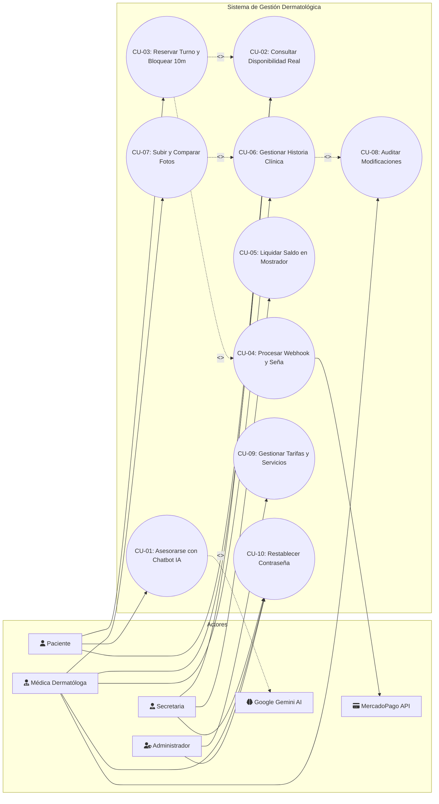
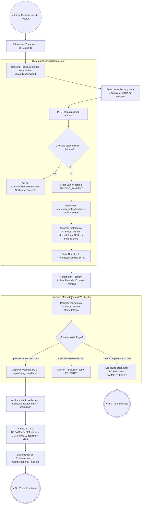
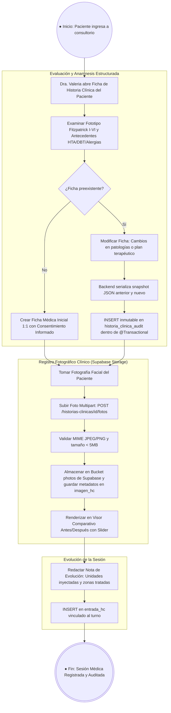
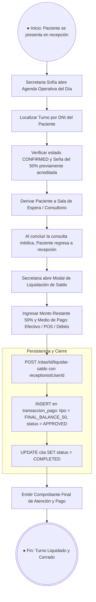
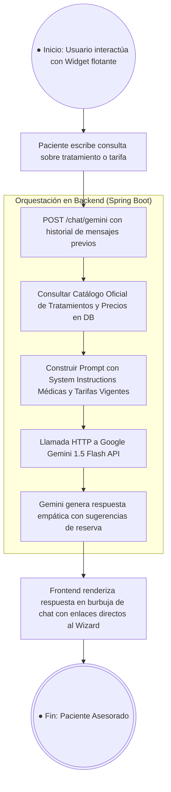
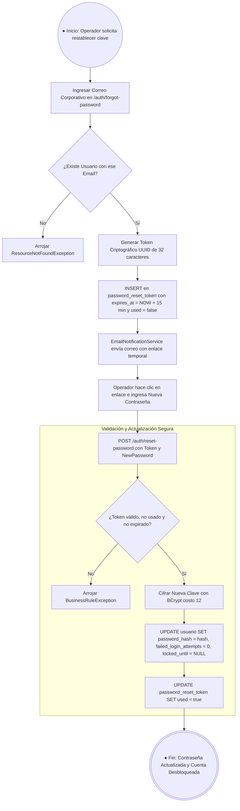

# Documento de Modelado de Procesos BPMN 2.0 y Especificación Formal de Casos de Uso (Fase 4)

**Proyecto:** Sistema Integral de Gestión Dermatológica, Estética y Asistente Virtual con IA  
**Cátedra:** Ingeniería del Software II — Entrega I & II / Trabajo Práctico Especial (TPE)  
**Fecha:** 2026-08-22 · **Versión:** 4.0.0  
**Autores:** Equipo de Arquitectura & Desarrollo

---

## 📑 Índice de Contenidos

1. [🏛️ Diagrama General de Casos de Uso del Sistema (UML)](#1-diagrama-general-de-casos-de-uso-del-sistema-uml)
2. [🔄 Modelado de Procesos de Negocio en BPMN 2.0](#2-modelado-de-procesos-de-negocio-en-bpmn-20)
   - [Proceso PR-01: Reserva de Turno Online, Bloqueo Temporal (10 min) y Cobro de Seña](#proceso-pr-01-reserva-de-turno-online-bloqueo-temporal-10-min-y-cobro-de-seña)
   - [Proceso PR-02: Consulta Médica, Registro Fotográfico y Auditoría Legal](#proceso-pr-02-consulta-médica-registro-fotográfico-y-auditoría-legal)
   - [Proceso PR-03: Recepción, Liquidación de Saldo (50%) en Mostrador y Cierre](#proceso-pr-03-recepción-liquidación-de-saldo-50-en-mostrador-y-cierre)
   - [Proceso PR-04: Asesoramiento Inteligente con Google Gemini AI](#proceso-pr-04-asesoramiento-inteligente-con-google-gemini-ai)
   - [Proceso PR-05: Recuperación de Contraseña con Token Temporal](#proceso-pr-05-recuperación-de-contraseña-con-token-temporal)
3. [📋 Especificación Formal de Casos de Uso Detallados (CU-01 a CU-08)](#3-especificación-formal-de-casos-de-uso-detallados-cu-01-a-cu-08)
4. [🔗 Matriz de Trazabilidad (Objetivos vs Casos de Uso vs Entidades)](#4-matriz-de-trazabilidad-objetivos-vs-casos-de-uso-vs-entidades)

---

## 1. 🏛️ Diagrama General de Casos de Uso del Sistema (UML)

---

## 2. 🔄 Modelado de Procesos de Negocio en BPMN 2.0

### Proceso PR-01: Reserva de Turno Online, Bloqueo Temporal (10 min) y Cobro de Seña

---

### Proceso PR-02: Consulta Médica, Registro Fotográfico y Auditoría Legal

---

### Proceso PR-03: Recepción, Liquidación de Saldo (50%) en Mostrador y Cierre

---

### Proceso PR-04: Asesoramiento Inteligente con Google Gemini AI

---

### Proceso PR-05: Recuperación de Contraseña con Token Temporal

---

## 3. 📋 Especificación Formal de Casos de Uso Detallados (CU-01 a CU-08)

---

### Caso de Uso CU-01: Consultar Asistente IA sobre Tratamientos y Precios
- **Identificador:** CU-01
- **Nombre:** Asesoramiento Virtual con Google Gemini API
- **Actor Principal:** Paciente / Visitante del sitio web
- **Actores Secundarios:** Google Gemini 1.5 Flash API, Catálogo de Servicios
- **Descripción:** El paciente realiza preguntas abiertas sobre procedimientos estéticos, recuperación, contraindicaciones o precios, y el sistema responde en lenguaje natural con datos actualizados del catálogo.
- **Precondiciones:** El usuario tiene conexión a internet y el servicio de Gemini API está operativo.
- **Postcondiciones de Éxito:** El paciente recibe una respuesta clara, empática y con botones de derivación directa a la reserva del turno.
- **Flujo Principal:**
  1. El paciente hace clic en el widget flotante del chatbot en el Landing.
  2. El sistema despliega la ventana de conversación con mensaje de bienvenida.
  3. El paciente escribe su duda (ej. *'¿Cuánto cuesta el peeling y cada cuánto se hace?'*).
  4. El frontend envía el mensaje junto con el historial al endpoint `POST /api/v1/chat/gemini`.
  5. El backend inyecta los precios vigentes en el contexto y consulta a Gemini 1.5 Flash.
  6. Gemini genera la respuesta adaptada al tono de la clínica médica.
  7. El frontend renderiza la respuesta y resalta el tratamiento con enlace a reserva.
- **Flujos Alternativos:**
  - *3a. El paciente pregunta por un tratamiento no estético / emergencia médica:* El sistema responde recordando que no reemplaza una guardia médica e invita a una consulta diagnóstica presencial.
- **Flujos de Excepción:**
  - *5a. Error de conexión con Google Gemini API:* El sistema captura el error en `GlobalExceptionHandler` y retorna un mensaje de contingencia invitando al usuario a ver el catálogo público directamente.

---

### Caso de Uso CU-02: Consultar Disponibilidad de Turnos en Tiempo Real
- **Identificador:** CU-02
- **Nombre:** Cálculo Dinámico de Franjas Horarias Disponibles
- **Actor Principal:** Paciente / Secretaria / Médica
- **Descripción:** Calcula y muestra las franjas horarias libres entre las 09:00 y las 19:00 hs para una fecha y tratamiento específico.
- **Precondiciones:** La fecha seleccionada debe ser igual o posterior a la fecha actual y el servicio debe estar activo.
- **Postcondiciones de Éxito:** Se retorna una lista de `TimeSlotDTO` indicando franjas libres (`available: true`) y ocupadas (`available: false`).
- **Flujo Principal:**
  1. El usuario selecciona el tratamiento deseado y la fecha en el calendario.
  2. El frontend ejecuta `GET /api/v1/citas/disponibilidad?fecha=YYYY-MM-DD&servicioId=X`.
  3. El backend obtiene la duración del servicio en minutos.
  4. El backend genera intervalos de 30 minutos entre las 09:00 y 19:00 hs.
  5. Para cada intervalo, verifica que no colisione con citas confirmadas, bloqueos temporales activos (<10 min) ni bloqueos de calendario.
  6. Verifica que la hora de inicio respete la antelación mínima de 2 horas.
  7. El backend retorna el listado y el frontend habilita únicamente los botones de horarios disponibles.

---

### Caso de Uso CU-03: Reservar Turno con Bloqueo Temporal (10 min) y Pagar Seña
- **Identificador:** CU-03
- **Nombre:** Reserva de Turno con Retención de 10 min y Checkout Pro
- **Actor Principal:** Paciente
- **Actores Secundarios:** MercadoPago Checkout Pro, Servicio de Notificaciones
- **Descripción:** El paciente bloquea una franja horaria durante 10 minutos para pagar el 50% de la seña en MercadoPago y confirmar su cita.
- **Precondiciones:** El paciente seleccionó un horario libre calculado en CU-02 y completó sus datos de filiación.
- **Postcondiciones de Éxito:** El turno queda registrado en `PENDING_PAYMENT` con deadline a 10 min y se genera la preferencia de pago en MercadoPago.
- **Flujo Principal:**
  1. El paciente envía el formulario de reserva (`POST /api/v1/citas/reservar-temporal`).
  2. El backend valida en una transacción que la franja continúe libre.
  3. El backend calcula el 50% del precio base del servicio.
  4. El backend inserta la cita con `status = PENDING_PAYMENT` y `temporary_hold_deadline = NOW() + 10 min`.
  5. El backend invoca a MercadoPago SDK creando la preferencia de pago con `external_reference = appointmentId`.
  6. El backend persiste la transacción en `PENDING`.
  7. El frontend inicia la cuenta regresiva de 10 minutos y muestra el botón oficial de MercadoPago.
  8. El paciente hace clic y es redirigido a la pasarela segura para pagar.
- **Flujos Alternativos:**
  - *2a. Concurrencia (otro usuario reservó la misma franja milisegundos antes):* El control `@Version` o la consulta de colisión arroja `SlotUnavailableException`. El sistema notifica al paciente para que elija otro horario sin cobrarle.
- **Flujos de Excepción:**
  - *8a. El paciente no completa el pago en 10 minutos:* El scheduler en segundo plano ejecuta `releaseExpiredHoldsScheduler()` y actualiza el estado a `PAYMENT_FAILED`, liberando el horario para otros pacientes.

---

### Caso de Uso CU-04: Procesar Webhook y Confirmar Reserva
- **Identificador:** CU-04
- **Nombre:** Confirmación Asíncrona de Turnos vía Webhooks de MercadoPago
- **Actor Principal:** MercadoPago Webhook Engine (Sistema Externo)
- **Actores Secundarios:** Paciente (Receptor de email)
- **Descripción:** Procesa la notificación HTTP de pago de MercadoPago, valida su autenticidad en la API oficial, cambia el estado del turno a `CONFIRMED` y envía el comprobante por correo electrónico.
- **Precondiciones:** Existe una cita en estado `PENDING_PAYMENT` asociada al `external_reference`.
- **Postcondiciones de Éxito:** La cita pasa a `CONFIRMED`, se libera el candado temporal (`temporary_hold_deadline = NULL`) y se despacha el correo de confirmación.
- **Flujo Principal:**
  1. MercadoPago envía una petición `POST /api/v1/pagos/webhook` con el `payment_id`.
  2. El backend recibe el payload y consulta los detalles del pago en la API oficial de MercadoPago.
  3. El backend verifica que el estado sea `approved`.
  4. El backend recupera el `appointmentId` del `external_reference`.
  5. En una transacción atómica `@Transactional`, actualiza `cita.status = CONFIRMED` y `transaccion_pago.status = APPROVED`.
  6. El `EmailNotificationService` envía un correo con el comprobante y fecha del turno al email del paciente.
  7. El backend responde `HTTP 200 OK` a MercadoPago para confirmar la recepción del webhook.

---

### Caso de Uso CU-05: Registrar Liquidación de Saldo en Mostrador y Asistencia
- **Identificador:** CU-05
- **Nombre:** Cobro en Mostrador del Saldo Restante (50%)
- **Actor Principal:** Secretaria (`RECEPTIONIST`)
- **Actores Secundarios:** Paciente, Médica
- **Descripción:** La secretaria registra el cobro presencial del 50% restante (en efectivo, débito o POS) al finalizar la atención médica y cierra el turno como `COMPLETED`.
- **Precondiciones:** El turno debe estar en estado `CONFIRMED`.
- **Postcondiciones de Éxito:** Se crea una transacción de pago `FINAL_BALANCE_50` aprobada y la cita pasa a `COMPLETED`.
- **Flujo Principal:**
  1. La secretaria abre la Agenda Operativa y localiza al paciente.
  2. Al terminar la consulta médica, hace clic en *'Cobrar Saldo'*.
  3. El sistema muestra el modal con el precio total acordado, el 50% pagado online y el saldo restante exacto.
  4. La secretaria selecciona el medio de pago presencial y confirma.
  5. El backend registra la transacción con el ID de la secretaria en `receptionist_user_id`.
  6. El estado del turno cambia a `COMPLETED`.
  7. La secretaria imprime o entrega el recibo de cancelación total al paciente.

---

### Caso de Uso CU-06: Gestionar Historia Clínica Digital y Ficha Anamnésica
- **Identificador:** CU-06
- **Nombre:** Administración de Historia Clínica y Ficha Dermatológica
- **Actor Principal:** Médica Dermatóloga (`PHYSICIAN`)
- **Descripción:** La médica registra o actualiza los antecedentes patológicos, alergias, fototipo de Fitzpatrick (I a VI), consentimientos y evoluciones por sesión.
- **Precondiciones:** La usuaria debe estar autenticada con rol `PHYSICIAN`.
- **Postcondiciones de Éxito:** La ficha médica queda guardada y, si hubo modificaciones, se inserta automáticamente un registro inmutable en `historia_clinica_audit`.
- **Flujo Principal:**
  1. La médica selecciona al paciente en el módulo de Historia Clínica.
  2. El sistema recupera la ficha existente o presenta el formulario en blanco.
  3. La médica evalúa el fototipo cutáneo (I a VI) y marca antecedentes (HTA, DBT, hipotiroidismo, cicatrización queloide).
  4. Marca alergias a anestésicos locales u otros fármacos.
  5. Redacta el diagnóstico y plan terapéutico propuesto.
  6. Hace clic en *'Guardar y Auditar Ficha'*.
  7. El backend detecta si es una actualización: serializa el estado anterior y el nuevo en formato JSON y realiza un `INSERT` en `historia_clinica_audit`.
  8. El backend persiste la ficha en `historia_clinica` y retorna confirmación con badge de auditoría activa.

---

### Caso de Uso CU-07: Subir y Comparar Fotografías Médicas (Antes / Después)
- **Identificador:** CU-07
- **Nombre:** Registro Fotográfico Clínico y Visor Comparativo
- **Actor Principal:** Médica Dermatóloga (`PHYSICIAN`)
- **Actores Secundarios:** Supabase Storage
- **Descripción:** La médica sube fotografías del rostro o zona tratada del paciente y utiliza el deslizador interactivo para contrastar la evolución estética entre sesiones.
- **Precondiciones:** Existe una historia clínica creada para el paciente.
- **Postcondiciones de Éxito:** La imagen se almacena en el bucket privado de Supabase Storage y se registra su metadato en la tabla `imagen_hc`.
- **Flujo Principal:**
  1. La médica accede a la pestaña *'Antes / Después'* de la historia clínica.
  2. Selecciona un archivo de imagen (`.jpg`, `.png`, `.webp`) y agrega una descripción clínica (ej. *'Pre-tratamiento Peeling Sesión 1'*).
  3. El frontend envía la imagen vía `multipart/form-data` al endpoint `POST /api/v1/historias-clinicas/{id}/fotos`.
  4. El backend valida tipo MIME y tamaño (<5MB), genera un UUID y sube el archivo a Supabase Storage.
  5. El backend guarda la ruta y metadatos en `imagen_hc` y retorna la URL segura.
  6. La médica selecciona la foto inicial y la foto de control en el componente `BeforeAfterSlider`.
  7. La médica desplaza el divisor horizontal para evaluar visualmente la mejoría cutánea junto al paciente.

---

### Caso de Uso CU-08: Auditar Modificaciones de Historias Clínicas
- **Identificador:** CU-08
- **Nombre:** Consulta de Trazabilidad y Auditoría Médico-Legal
- **Actor Principal:** Médica Dermatóloga (`PHYSICIAN`) / Auditor Médico
- **Descripción:** Permite auditar la línea de tiempo completa de una historia clínica, visualizando quién realizó cada cambio, en qué fecha y cuáles fueron los valores modificados resaltados en colores.
- **Precondiciones:** Autenticación con rol `PHYSICIAN`.
- **Postcondiciones de Éxito:** Se muestra la cronología inmutable obtenida desde `historia_clinica_audit`.
- **Flujo Principal:**
  1. La médica ingresa a la pestaña *'Auditoría Legal'* del paciente.
  2. El frontend solicita `GET /api/v1/historias-clinicas/{id}/auditoria`.
  3. El backend consulta la tabla `historia_clinica_audit` ordenada cronológicamente de forma descendente.
  4. El componente `AuditTimelineView` renderiza la línea de tiempo.
  5. Para cada evento, muestra el nombre de la médica autora, la fecha/hora exacta y resalta en rojo los datos anteriores y en verde los datos nuevos.

---

## 4. 🔗 Matriz de Trazabilidad (Objetivos vs Casos de Uso vs Entidades)

| Objetivo del Negocio (PRD) | Casos de Uso Asociados | Entidades de Base de Datos Involucradas | Módulos del Sistema |
| :--- | :--- | :--- | :--- |
| **O1: Eliminar Absentismo con Señas del 50%** | `CU-02`, `CU-03`, `CU-04` | `cita`, `transaccion_pago`, `servicio_dermatologico`, `bloqueo_calendario` | Reserva Online & MercadoPago |
| **O2: Concurrencia y Retención de 10 min** | `CU-02`, `CU-03` | `cita` (`@Version`, `temporary_hold_deadline`), `bloqueo_calendario` | Motor de Disponibilidad & Schedulers |
| **O3: Ficha Médica 1:1 Estructurada** | `CU-06` | `historia_clinica`, `paciente`, `entrada_hc` | Historia Clínica Digital |
| **O4: Trazabilidad y Auditoría Inmutable** | `CU-06`, `CU-08` | `historia_clinica_audit`, `entrada_hc_audit`, `usuario` | Auditoría Médico-Legal |
| **O5: Registro Fotográfico Seguro** | `CU-07` | `imagen_hc`, `historia_clinica`, *Supabase Storage* | Visor Antes/Después & Storage |
| **O6: Asesoramiento Inteligente 24/7** | `CU-01` | `servicio_dermatologico`, *Google Gemini API* | Chatbot IA & Portal Público |
